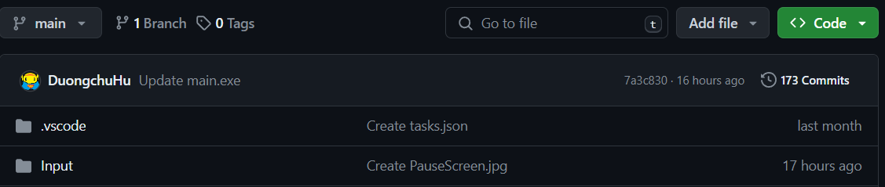
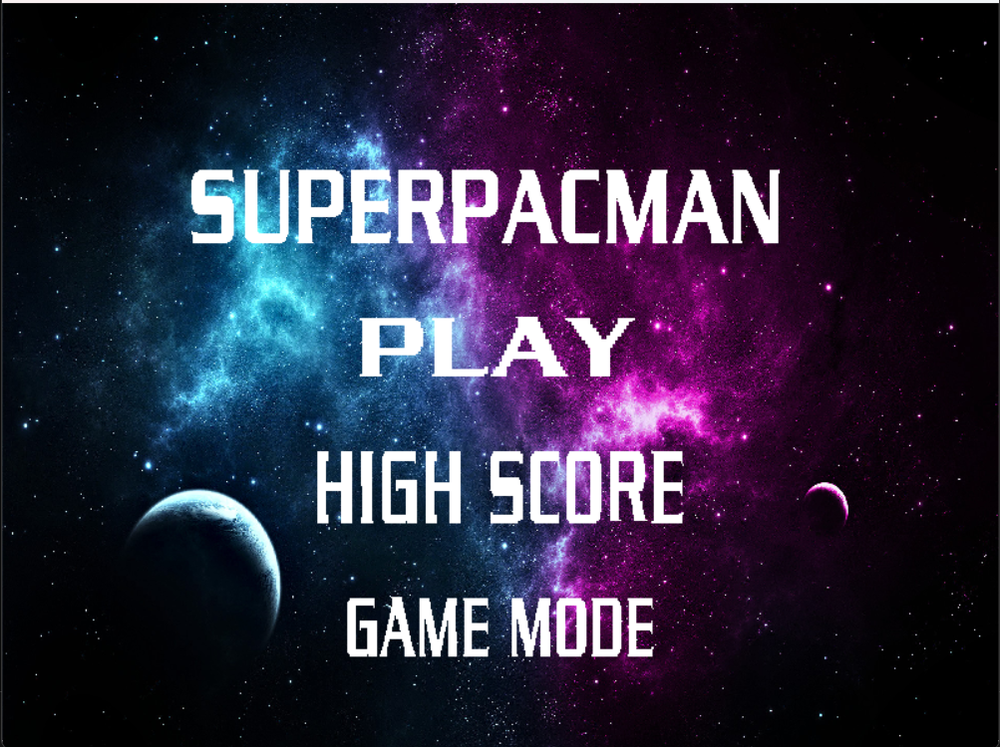
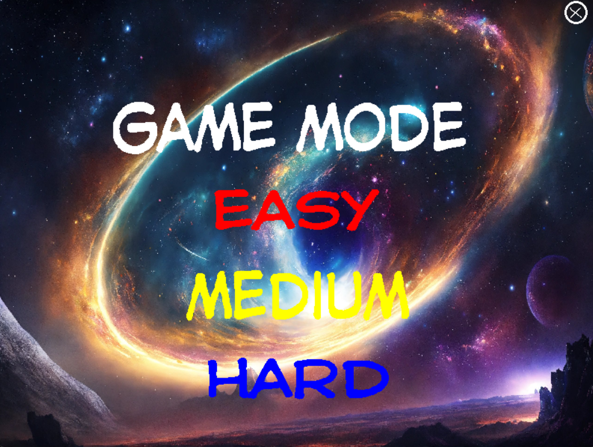
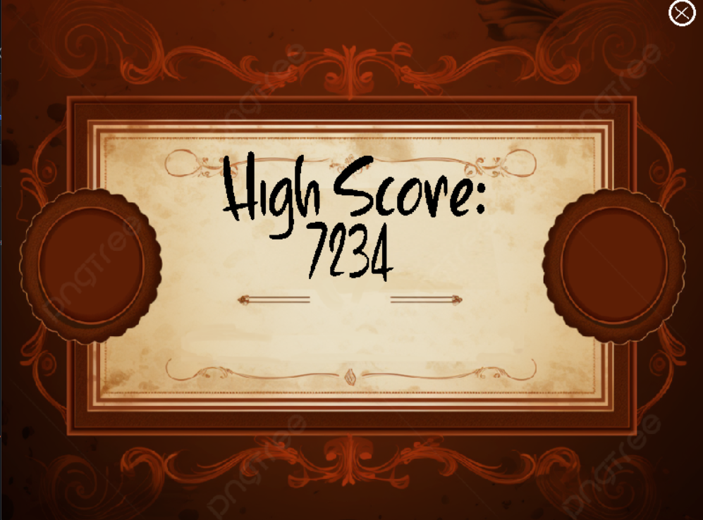
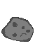

SuperPacMan - Luong Thanh Vinh Edition

- Thử nghiệm game: [https://youtu.be/]

# Giới thiệu game

SuperPacman là tựa game mà bạn phải tự mình điều khiển Pacman di chuyển trong vũ trụ sao cho
vừa tránh né những thiên thạch rơi xuống, vừa phải ăn những đồng xu và sinh tồn càng lâu càng
tốt

- [0. Cách tải game](#0-cách-tải-game)
    * [Bao gồm code và có thể biên dịch.](#a-bao-gồm-code-và-có-thể-biên-dịch)
- [1. Bắt đầu game](#1bắt-đầu-game)
- [2. Chọn Mode](#2chọn-Mode)
- [3. Các thành phần trong game:](#3-các-thành-phần-trong-game)
- [4. Cách chơi](#4-cách-chơi)
    * [a. Các vật thể trong game](#a-các-vật-thể-trong-game)
- [5. Game Over](#5-Game-over)
- [Về đồ họa của game:](#về-đồ-họa-của-game)
- [Về source code game](#về-source-code-game)

# 0. Cách tải game

## Bao gồm code và có thể biên dịch.

**Bước 1:** Clone repo này về.  
Hoặc Chọn Code -> Download Zip (Khoảng 90MB)

- Có thể nhảy đến bước 5 để chơi luôn.

**Bước 2:** Cài mingw. Ở đây tôi cài đặt phiên bản MinGW-W64
GCC-8.1.0 [x86_64-posix-seh](https://sourceforge.net/projects/mingw-w64/files/Toolchains%20targetting%20Win64/Personal%20Builds/mingw-builds/8.1.0/threads-posix/seh/x86_64-8.1.0-release-posix-seh-rt_v6-rev0.7z/download). Ngoài ra các bạn có thể tìm kiếm và tải các bản mới hơn nếu có. 
Một số chú ý:  

- Phải xóa ba dll của c++ trong thư mục chứa pvz.exe: `libgcc_s_seh-1.dll`, `libstdc++-6.dll`, `libogg-0.dll`. Ba dll này chỉ dành cho người chơi không cài sẵn c++ trong máy.

**Bước 3:** Cài GNU make

**Bước 4:** Mở cmd trong thư mục chứa Makefile và gõ lệnh make hoặc mingw32-make.

**Bước 5:** Bật main.exe và chơi

# 1. Bắt đầu game

Chờ một chút rồi click vào nút “PLAY” để bắt đầu chơi game.

Ngoài ra, khi bạn muốn chọn thêm chế độ cho game, hãy bấm và GAME MODE. Trong GAME MODE có 3 chế độ là EASY, MEDIUM và HARD cho bạn lựa chọn.

Nếu như bạn muốn kiểm tra lại số điểm cao nhất mà mình đã đạt được, hãy bấm vào HIGH SCORE

# 2. Chọn MODE

Có tổng cộng 3 level với mức độ khó dễ khác nhau để bạn chơi. Chỉ cần click chuột để chơi MODE đó.

Kkhi mới bắt đầu, chế độ chơi sẽ mặc định là chế độ EASY. Vì vậy nếu muốn trải nghiệm ngay chế độ khác thì đừng quên đổi chế độ ở màn hình chính nhé.

Ngoài ra, khi muốn quit khỏi màn hình chọn MODE, ngoài cách chọn chế độ chơi ra thì bạn có thể bấn dấu X nằm góc trên bên phải màn hình để có thể quay về với màn hình chính

# 3. Các thành phần trong game:

-    CNV (Chướng ngại vật) 
     : những cục thiên thạch rơi từ trên cao xuống, nếu bạn điều khiển Pacman và va chạm      với nó thì sẽ bị mất đi một mạng. Nếu số mạng về 0 thì bạn sẽ thua cuộc

-    Heart (Trái tim/ Số mạng còn lại) 
     : là bảng đếm số mạng chơi mà người chơi đang có. Số trái tim sẽ giảm dần nếu bạn        va chạm với thiên thạch. Hãy cố gắng sống càng lâu càng tốt

-    Coin (Đồng xu) 
     : là xu trong trò chơi. Với mỗi xu ăn được, số điểm của bạn sẽ tăng lên 100 điểm.        Hãy cố gắng sống thật lâu và ăn thật nhiều xu nhất có thể nhé!

-    Bullet (Đạn bắn) : Cứ sau 1.5s, Pacman sẽ tự động bắn ra viên đạn cực mạnh, phá hủy thiên thạch bất kì trên đường đi của nó. Đây là một công cụ cứu mạng tuyệt vời của bạn và Pacman. Hãy căn chỉnh sao cho đạn bắn trúng những viên thiên thạch vì điều đó sẽ khiến đường di chuyển của bạn thông thoáng hơn đấy.

-    SuperPacMan (Siêu Pacman) :
     Là một bản nâng cấp của PacMan, có siêu năng lực bay ra ngoài không gian để trốn tránh những kẻ ác, tuy nhiên lại gặp phải những cơn bão thiên thạch. Là nhân vật mạnh mẽ, có thể bắn Lazer từ mắt, vì vậy hãy đồng hành cùng cậu ấy càng lâu càng tốt nhé.

-    PauseBuuton (Nút Pause game) : Nếu thấy game quá khó khăn hoặc gặp phải việc gấp bất kì, bạn có thể click chuột vào nút pause game để quay về màn hình chờ, ngoài ra bạn có thể bấm phím Enter nếu đang trong tình cảnh rất khó khắn, ngặt nghèo.

-   PauseScreen (Màn hình chờ): Là màn hình để bạn có thể dành thời gian cho những việc gấp hơn hay đơn giản chỉ là dành chút thời gian thư giãn khi đang chơi chế độ HARD của chúng tôi. Bạn có thể bấm lại nút Enter để có thể chơi tiếp ở nơi game dừng lại, hoặc có thể bấm ESC để thoát game.

- Bố cục game cơ bản:

 

# 4. Cách chơi

Trồng cây để tấn công và phòng thủ, không cho zombie bước vào nhà bạn. 
Để trồng cây, Chọn hạt giống của cây đó (bàn phím hoặc click chuột) rồi đặt vào ô muốn trồng.  
Có thể đào những cây đang sử dụng bằng xẻng. 
Cây sẽ bị zombie ăn mất.

## a. Các loại cây

Có 6 loại cây, lần lượt theo thứ tự có thể nhận được trong game là:

|                                                                             | Tên cây	     | Chức năng                                                                                                                    |
|-----------------------------------------------------------------------------|--------------|------------------------------------------------------------------------------------------------------------------------------|
|   | Peashooter	  | Mỗi lần bắn một đậu vào zombie.                                                                                              |
|     | Sunflower	   | Tạo thêm mặt trời để trồng cây                                                                                               |
|           | Wall-nut	    | Chịu được nhiều phát ăn của zombie để bảo vệ các cây khác.                                                                   |
|         | Snow Pea	    | Mỗi lần bắn một đậu băng vào zombie. Đậu băng không tăng sát thương nhưng làm chậm tốc độ di chuyển và tốc độ ăn của zombie. |
|  | Potato Mine  | Tiêu diệt zombie khi chạm nó nhưng cần thời gian để kích hoạt.                                                               |
|   | Cherry Bomb	 | Ngay lập tức tiêu diệt tất cả zombie trong khu vực 3x3.                                                                      |

## b. Các loại zombie

- Có 5 loại zombie:

|                                         | Tên zombie 	       | Chức năng                                                                                        |
|-----------------------------------------|--------------------|--------------------------------------------------------------------------------------------------|
|  | Browncoat Zombie	  | Ăn cây và não của bạn.                                                                           |
|    | Flag Zombie	       | Báo hiệu một lượng lớn zombie đang chuẩn bị ra.                                                  |
|    | Conehead Zombie	   | Trâu gấp 3 lần zombie thường                                                                     |
|  | Buckethead Zombie	 | Trâu gấp 6.5 lần zombie thường                                                                   |
|    | Door Zombie	       | Trâu gấp 6.5 lần zombie thường. Không bị ảnh hưởng bởi sự làm chậm của đạn băng nếu vẫn còn cửa. |

# 5. Chiến thắng và thất bại

- Bạn sẽ chiến thắng nếu tiêu diệt hết tất cả zombie trong ván đó.

- Bạn sẽ thất bại nếu có một zombie nào đó đi hết sân để vào nhà bạn.

---

### Về đồ họa của game:

[[Cách làm hiệu ứng từng cây, zombie trong game]](about_graphics.md)

### Về source code game:

- Folder draw:
    * khởi tạo window và renderer
    * chứa tất cả các ảnh trong game (được đánh số)
    * chứa hầu hết các câu lệnh của SDL2, SDL2_image, SDL2_ttf, sử dụng để vẽ load ảnh, chữ và vẽ lên renderer, window.
- Folder elements: Chứa tất cả các thành phần của game:
    * bullets: các loại đạn
    * button: các loại nút trong game (có thể nhấn được hoặc không)
    * Map: chứa hàm random và khởi tạo bảng 5 x 9 cho màn chơi.
    * mower: máy cắt cỏ (Cán zombie)
    * plants: chứa tất cả các loại plant (được kế thừa từ class Plants)
    * zombies: chứa tất cả các loại zombies (được kế thừa từ class Zombie)
    * elements: gom lại các loại plants và zombies.
    * elements_actions:
        + chứa hầu hết các tương tác giữa các thành phần game với nhau, và với màn chơi.
        + tạo ngẫu nhiên zombie
        + cập nhật tất cả các thay đổi của game theo từng khung hình
- Folder events: Xử lý các sự kiện trong game (sự kiện chuột, bàn phím)
    * in_game: xử lý các sự kiện khi đang trong một màn chơi
        + credit: phần giới thiệu các loại zombie & ready-set-plant
        + game: tất cả các sự kiện trong một màn chơi
        + lose: xử lý khi thua
        + main_menu: xử lý khi người chơi muốn trở lại phần chọn màn chơi
        + pause_menu: xử lý khi người chơi dừng game (nút dừng hoặc click ra ngoài game)
        + restart_menu: xử lý khi người chơi muốn chơi lại màn chơi
        + turbo: xử lý nút tăng tốc game
        + volume: xử lý nút điều chỉnh âm lượng nhạc nền và hiệu ứng.
        + win: xử lý khi chiến thắng trò chơi.
    * mouse_cursor: xử lý con trỏ chuột
    * out_game: xử lý các sự kiện ngoài màn chơi
        + choose_level: xử lý chọn màn chơi
        + quit_menu: xử lý nút quit game: tắt game
        + reset_level: xử lý nút reset level: xóa tiến trình chơi
        + start_game: xử lý nút "Click to start" để bắt đầu vào game.
        + unlock_plant: xử lý mở khóa plant mới.
- Folder level: xử lý phần lấy dữ liệu ván chơi.
- Folder music: xử lý phần âm thanh của game - SDL2_mixer
- Folder player: xử lý phần dữ liệu người chơi. Bao gồm việc lấy và thay đổi tên, tiến trình.
- game_stats.hpp: chứa tất cả thông số game
- game.hpp và game.cpp: hàm main() của trò chơi.
