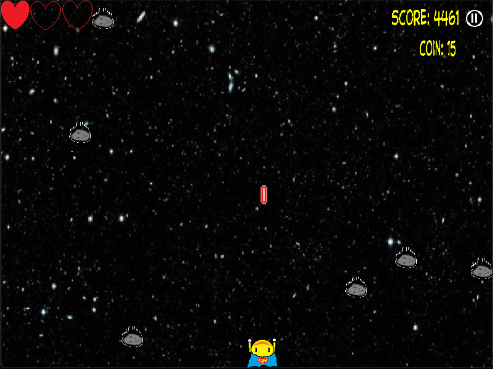

SuperPacMan - Luong Thanh Vinh Edition

- Thử nghiệm game: [https://youtu.be/]

# Giới thiệu game

SuperPacman là tựa game mà bạn phải tự mình điều khiển Pacman di chuyển trong vũ trụ sao cho
vừa tránh né những thiên thạch rơi xuống, vừa phải ăn những đồng xu và sinh tồn càng lâu càng
tốt

- [0. Cách tải game](#0-cách-tải-game)
    * [Bao gồm code và có thể biên dịch.](#a-bao-gồm-code-và-có-thể-biên-dịch)
- [1. Bắt đầu game](#1-bắt-đầu-game)
- [2. Chọn Mode](#2-chọn-Mode)
- [3. Các thành phần trong game:](#3-các-thành-phần-trong-game)
   * [a. Các vật thể trong game](#a-các-vật-thể-trong-game)
- [4. Cách chơi](#4-cách-chơi)
- [5. Game Over](#5-Game-over)
- [Về đồ họa và âm thanh của game:](#về-đồ-họa-và-âm-thanh-của-game)
- [Về source code game](#về-source-code-game)

# 0. Cách tải game

## a. Bao gồm code và có thể biên dịch.

**Bước 1:** Clone repo này về.  
Hoặc Chọn Code -> Download Zip (Khoảng 90MB)

- Có thể nhảy đến bước 5 để chơi luôn.

**Bước 2:** Cài mingw. Ở đây tôi cài đặt phiên bản MinGW-W64
GCC-8.1.0 [x86_64-posix-seh](https://sourceforge.net/projects/mingw-w64/files/Toolchains%20targetting%20Win64/Personal%20Builds/mingw-builds/8.1.0/threads-posix/seh/x86_64-8.1.0-release-posix-seh-rt_v6-rev0.7z/download). Ngoài ra các bạn có thể tìm kiếm và tải các bản mới hơn nếu có. 
Một số chú ý:  

- Phải xóa ba dll của c++ trong thư mục chứa pvz.exe: `libgcc_s_seh-1.dll`, `libstdc++-6.dll`, `libogg-0.dll`. Ba dll này chỉ dành cho người chơi không cài sẵn c++ trong máy.

**Bước 3:** Cài GNU make

**Bước 4:** Mở cmd trong thư mục chứa Makefile và gõ lệnh make hoặc mingw32-make.

**Bước 5:** Bật main.exe và chơi

# 1. Bắt đầu game

Chờ một chút rồi click vào nút “PLAY” để bắt đầu chơi game.

Ngoài ra, khi bạn muốn chọn thêm chế độ cho game, hãy bấm và GAME MODE. Trong GAME MODE có 3 chế độ là EASY, MEDIUM và HARD cho bạn lựa chọn.

Nếu như bạn muốn kiểm tra lại số điểm cao nhất mà mình đã đạt được, hãy bấm vào HIGH SCORE

# 2. Chọn MODE

Có tổng cộng 3 level với mức độ khó dễ khác nhau để bạn chơi. Chỉ cần click chuột để chơi MODE đó.

Kkhi mới bắt đầu, chế độ chơi sẽ mặc định là chế độ EASY. Vì vậy nếu muốn trải nghiệm ngay chế độ khác thì đừng quên đổi chế độ ở màn hình chính nhé.

Ngoài ra, khi muốn quit khỏi màn hình chọn MODE, ngoài cách chọn chế độ chơi ra thì bạn có thể bấn dấu X nằm góc trên bên phải màn hình để có thể quay về với màn hình chính

# 3. Các thành phần trong game:
   # a-các-vật-thể-trong-game
-    CNV (Chướng ngại vật) 
     : những cục thiên thạch rơi từ trên cao xuống, nếu bạn điều khiển Pacman và va chạm      với nó thì sẽ bị mất đi một mạng. Nếu số mạng về 0 thì bạn sẽ thua cuộc

-    Heart (Trái tim/ Số mạng còn lại) 
     : là bảng đếm số mạng chơi mà người chơi đang có. Số trái tim sẽ giảm dần nếu bạn        va chạm với thiên thạch. Hãy cố gắng sống càng lâu càng tốt

-    Coin (Đồng xu) 
     : là xu trong trò chơi. Với mỗi xu ăn được, số điểm của bạn sẽ tăng lên 100 điểm.        Hãy cố gắng sống thật lâu và ăn thật nhiều xu nhất có thể nhé!

-    Bullet (Đạn bắn) : Cứ sau 1.5s, Pacman sẽ tự động bắn ra viên đạn cực mạnh, phá hủy thiên thạch bất kì trên đường đi của nó. Đây là một công cụ cứu mạng tuyệt vời của bạn và Pacman. Hãy căn chỉnh sao cho đạn bắn trúng những viên thiên thạch vì điều đó sẽ khiến đường di chuyển của bạn thông thoáng hơn đấy.

-    SuperPacMan (Siêu Pacman) :
     Là một bản nâng cấp của PacMan, có siêu năng lực bay ra ngoài không gian để trốn tránh những kẻ ác, tuy nhiên lại gặp phải những cơn bão thiên thạch. Là nhân vật mạnh mẽ, có thể bắn Lazer từ mắt, vì vậy hãy đồng hành cùng cậu ấy càng lâu càng tốt nhé.

-    PauseBuuton (Nút Pause game) : Nếu thấy game quá khó khăn hoặc gặp phải việc gấp bất kì, bạn có thể click chuột vào nút pause game để quay về màn hình chờ, ngoài ra bạn có thể bấm phím Enter nếu đang trong tình cảnh rất khó khắn, ngặt nghèo.

-   PauseScreen (Màn hình chờ): Là màn hình để bạn có thể dành thời gian cho những việc gấp hơn hay đơn giản chỉ là dành chút thời gian thư giãn khi đang chơi chế độ HARD của chúng tôi. Bạn có thể bấm lại nút Enter để có thể chơi tiếp ở nơi game dừng lại, hoặc có thể bấm ESC để thoát game.

- Bố cục game cơ bản:

 

# 4. Cách chơi

Dùng 4 phím di chuyển LÊN, XUỐNG, TRÁI, PHẢI để điều khiển PacMan sao cho PacMan vừa tránh né những thiên thạch đang lao xuống cũng như là ăn được càng nhiều đồng xu càng tốt. Hãy sống sót thật lâu, lâu nhất có thể bởi vì bạn sống càng lâu, điểm càng cao. Khuyến khích nên trải nghiệm chế độ HARD đầu tiên.

# 5. Game Over

- Bạn sẽ thất bại nếu như số mạng của bạn đã hết. Nếu như muốn thử lại, bạn có thể click chuột vào PLAY AGAIN, còn nếu không hãy bấm EXIT để thoát khỏi game.

---

### Về đồ họa và âm thanh của game:

[[Cách thực hiện đồ họa và âm thanh của game]](src/DoHoaGame.txt)

### Về source code game:
- Chia làm 3 phần main.cpp, Game.cpp và TextureManager.cpp
- Main.cpp là chương trình chạy chính của game, bao gồm 2 file Game.cpp và TextureManager.cpp, việc thực hiện chạy chương trình được thực hiện tại main.cpp
- TextureManager.cpp là chương trình dùng để load các SDL_Texture trong chương trình, sử dụng thư viện SDL2.0
- Game.cpp là chương trình bao gồm các hàm chính của main, được thêm vào main để xử lí các hành động của bạn đối với game:
  * Hàm init dùng để khai báo và khởi tạo những giá trị ban đầu cho game.
  * Hàm close là hàm kết thúc chương trình, khi chương trình kết thúc sẽ giải phóng bộ nhớ và những biến được lưu trong chương trình.
  * Hàm orintPlayScreen có công việc chính là in ra màn hình chơi cũng như là nơi tiếp nhận và xử lí những sự kiện chuột và bàn phím. Bạn sẽ được chơi game tại màn hình này.
  * Hàm printMainScreen có công việc chính là in ra màn hình chính với những chức năng nhất định, xử lí sự kiện chuột để chuyển qua các màn hình tiếp theo.
  * Hàm printScoreScreen là hàm in ra màn hình ghi điểm cao nhất của người chơi.
  * Hàm printGameModeScreen là hàm in ra màn hình chuyển chế độ game, xử lí sự kiện chuột để chuyển đổi chế độ game theo như ý muốn của người chơi
  * Hàm printGameOverScreen in ra màn hình thua Game over, cho phép người chơi xem lại điểm đã chơi cũng như cho phéo người chơi chơi lại hoặc thoát khỏi game nếu muốn.
  * Hàm printPauseScreen in ra màn hình chờ, nhận sự kiện bàn phím, khi bấm Enter sẽ quay lại màn hình chơi game, còn ESC sẽ thoát khỏi game nếu muốn.
  * Hàm pushScore là hàm đẩy điểm của người chơi vào trong file HighScore nếu như điểm người chơi cao hơn điểm cao nhất hiện tại.
  * Hàm SwitchScreen là hàm đảm nhận vai trò chuyển đổi qua lại giữa các màn hình trong game
  * Hàm run là hàm kiểm tra nếu như chương trình không còn lỗi gì thì sẽ bắt đầu chạy bằng cách in ra màn hình chính
